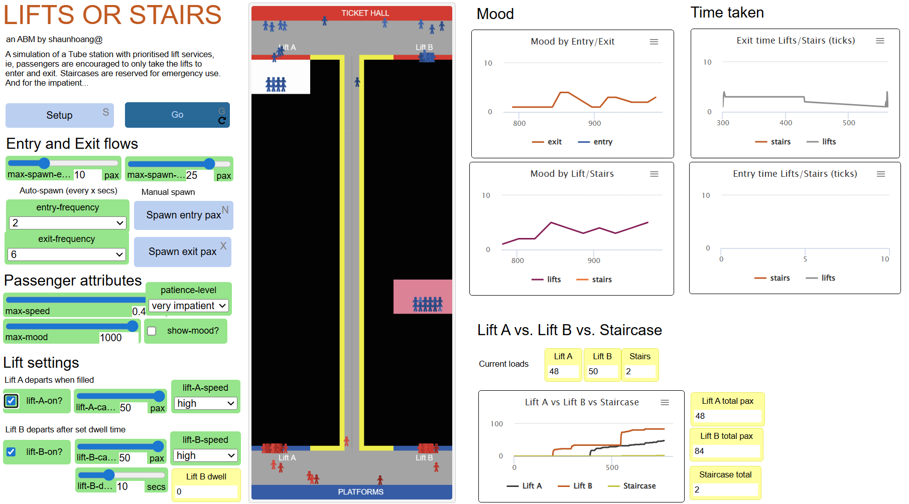

# Lifts or Stairs?

## An Agent-based approach to improve Transit Passenger Experience

The London Underground network has about twenty stations with lift-only access for entry and exit. Passengers are actively discouraged from using the emergency staircase due to their tight space and depth, equivalent to a 15-storey building in some places. However, many impatient passengers hike the steep steps anyway when faced with long waits for the lifts during peak hours.
With an agent-based approach, we seek to investigate: How can we optimise passenger experience in stations with this type of constraint?

### ODD Protocol

#### 1. Purpose:
The model simulates a station with prioritised lift access and an emergency staircase with various parameters (lift speed, lift movement logic, patience level, number of people, etc.) to understand how to optimise passenger experience. The model could also be used to determine the lift operation strategy to minimise emergency staircase usage.
	
#### 2. Entities, state variables, and scales: 
There are two types of agents: entry and exit passengers travelling in opposite directions. On one side is the “Ticket Hall,” where entry passengers originate; on the other, there are the “Platforms,” where exit passengers originate. Key state variables are mood (starting satisfaction level) and patience level (how long they are willing to wait for the lifts before taking the stairs). Agents are also spawned with different speed and mood values that vary slightly around the max-speed and max-mood global parameters.
The model has a temporal scale of minutes and a small spatial scale, simulating a real-time Tube station. Finally, the spatial assumption here is that the Platforms are at a lower level than the Ticket Hall, meaning that exiting passengers who take the stairs face more difficulty.

#### 3. Process overview and scheduling: 
Agents are spawned at different intervals and quantities, simulating train arrivals and individuals entering the station. Agents wait for and take the closest functioning lift to reach their respective destinations (i.e., Ticket Hall for exit passengers and Platforms for entry passengers). Agents will get out and proceed forward when the lifts arrive at the desired level.
However, while waiting for the lifts, agents become impatient and lose mood. Once this hits a patience level threshold, agents will abandon the wait and proceed to take the stairs. Lastly, since the emergency staircase is a tight space, agents will also have to negotiate their way by overtaking and switching ‘lanes’ if blocked, which also affects their eventual mood. Note that in this model, the users cannot directly configure the different levels of mood decrease for each type of ‘inconveniences'.

#### 4. Design concepts

- *Adaptation.* The two lifts have different operating logic and can be turned off, affecting agents’ behaviour during the simulation. First, agents go to the closest functioning lift and wait. However, long waits for the lift decrease mood and may lead to a decision to take the stairs instead. Regarding lift operating logic, Lift A departs when filled to maximum capacity, while Lift B departs after the preset dwell time, regardless of the current passenger load.
- *Interaction.* Agents interact with other agents only along the narrow two-lane staircase. When blocked by agents going at a lower speed or agents going in the opposite direction, agents change lanes and also see decreased mood.
- *Observation.* Upon reaching their destinations, agents’ mood and time since spawning will be recorded, segmented by lift vs. stairs use and entry vs exit passengers. The distribution of these values by segment can be further analysed and compared to address the research question.

#### 5. Initialization: 
The model is initialised with no agents and with both functional lifts at max speed and max capacity. These parameters and others can be adjusted in the interface with sliders and switches before starting and during the simulation schedule.

#### 6. Input data: 
The model does not use external input data.

#### 7. Submodels: 
There are three key sub-models: 
- (1)	Choosing and taking the lift follows a set of sequential rules until the agents reach their destination. More specifically, agents pick the closest functional lift from where they spawn and head in that direction. They get in the lifts unless those have reached capacity. Once the lifts arrive at the destination level, agents leave the lift and proceed to the world's edge, where they have ‘arrived’ and die.
- (2)	Losing patience and giving up the lifts represents an alternative process for agents whose mood has decreased beyond the patience level threshold. This individual threshold is set as different proportions of mood, depending on the global patience level parameter. Once agents give up on waiting for the lifts, they find their way to the staircases, where they begin the climb up (or down).
- (3)	Moving inside the staircase requires agents to interact with other staircase-using agents by changing lanes if blocked by slower-moving agents ahead in the same lane or agents coming from the opposite direction. Within this dynamic, agents’ mood decreases every time they are blocked in any way. Exiting passengers also see their mood decrease gradually at each step to simulate the physical difficulty of climbing a steep staircase. 

### Brief Methodology
To examine the impact of various factors on passengers’ mood and time spent traversing the space in either direction or to minimise staircase usage, NetLogo BehaviorSpace can simulate and systematically produce distributions of resultant mood and time while varying these key parameters:

-	For **lift settings**, we are interested in different scenarios where two, one or none of the lifts are operational. If only one lift works, we can compare the two lift types: Lift A departs only when filled to maximum capacity, whereas Lift B departs at a regular interval. Lastly, lift speed, capacity, and dwell time (in the case of Lift B) are also relevant parameters.
-	For **passenger attributes**, the patience level is a parameter of interest. The model represents this as a five-level scale ranging from “very impatient” to “very patient”.
-	For **passenger flows**, the frequency and quantity of arriving and incoming passengers could lead to possible crowding of the station and a more drastic mood decrease. Varying them helps determine the optimal level of traffic the station can handle for any given lift configuration.

Finally, we may conclude statistically significant negative or positive effects by performing pairwise t-tests of the means (or ANOVA in case there are more than two parameter values) and through linear regressions.
